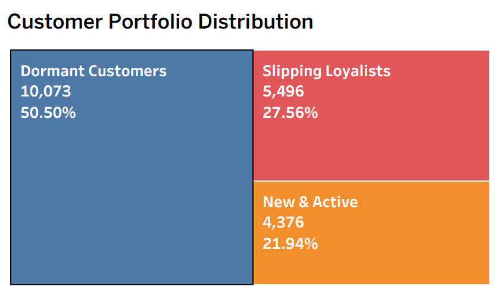
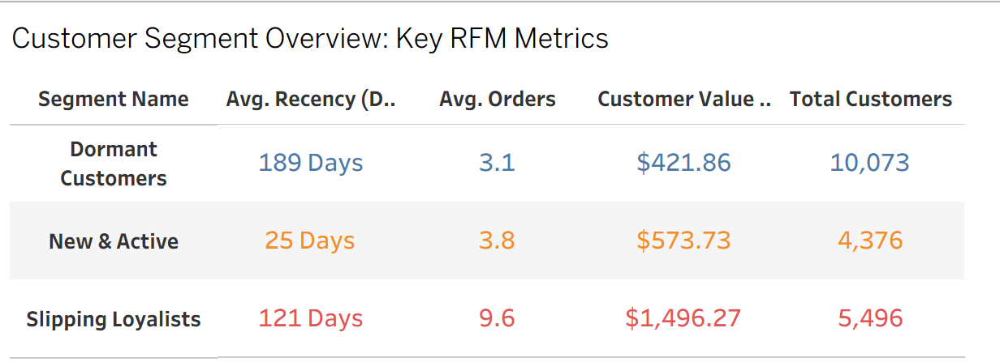
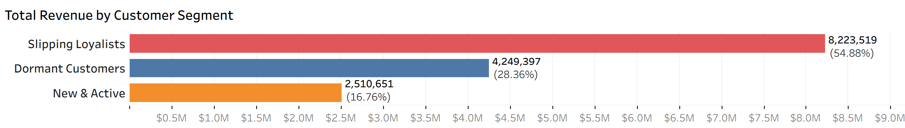
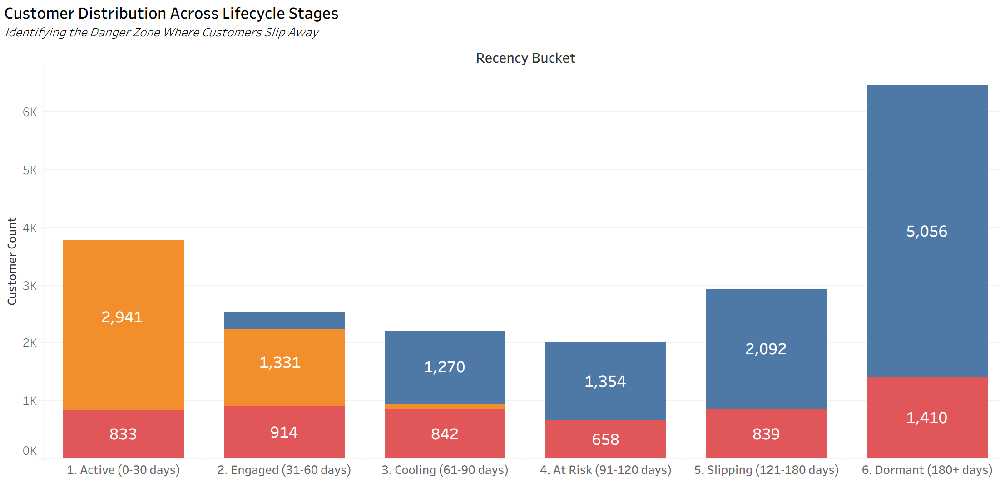
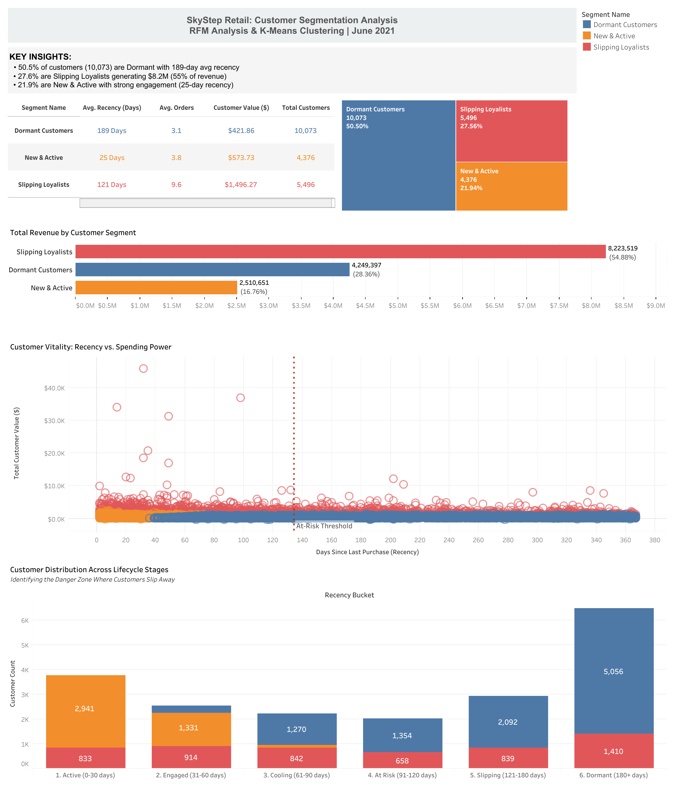

# SkyStep Retail: Customer Segmentation & RFM Analysis

## Project Background

SkyStep is a multi-channel retail company operating in the footwear and athletic apparel industry. The company sells products through both online and offline channels, serving a diverse customer base with varying purchase behaviors. As a data analyst at SkyStep, the primary objective is to understand customer value, identify distinct customer segments, and provide actionable insights to drive targeted marketing strategies and improve customer retention.

This analysis focuses on leveraging **RFM (Recency, Frequency, Monetary)** analysis combined with **K-Means clustering** to segment SkyStep's customer base into meaningful groups. These insights will enable the marketing team to tailor campaigns, optimize resource allocation, and maximize customer lifetime value.

**Insights and recommendations are provided on the following key areas:**

- **Customer Segmentation:** Identification of three distinct customer segments based on purchasing behavior
- **Revenue Concentration:** Analysis of high-value customers and their contribution to total revenue
- **Customer Lifecycle:** Understanding of customer engagement patterns and churn risk indicators
- **Channel Preferences:** Examination of online vs. offline purchasing behaviors across segments

**Technical Implementation:**
- SQL queries for data extraction and RFM metric calculation can be found in [`skystep_retail.sql`](skystep_retail.sql)
- Python code for K-Means clustering and segmentation can be found in [`RFM_analysis_skyStep.ipynb`](RFM_analysis_skyStep.ipynb)
- An interactive Tableau dashboard for exploring customer segments can be found in [`Skystep_retail.twb`](Skystep_retail.twb)

---

## Data Structure & Initial Checks

The SkyStep retail database consists of a single comprehensive table with **19,945 unique customer records**. The data structure is as follows:

**Table: `skystep_data`**

| Column Name | Data Type | Description |
|------------|-----------|-------------|
| `master_id` | UUID | Unique customer identifier (Primary Key) |
| `order_channel` | VARCHAR(50) | Primary channel used by customer |
| `last_order_channel` | VARCHAR(50) | Channel of most recent order |
| `first_order_date` | DATE | Date of customer's first purchase |
| `last_order_date` | DATE | Date of customer's most recent purchase |
| `last_order_date_online` | DATE | Most recent online purchase date |
| `last_order_date_offline` | DATE | Most recent offline purchase date |
| `order_num_total_ever_online` | FLOAT | Total number of online orders |
| `order_num_total_ever_offline` | FLOAT | Total number of offline orders |
| `customer_value_total_ever_offline` | FLOAT | Total revenue from offline purchases |
| `customer_value_total_ever_online` | FLOAT | Total revenue from online purchases |
| `interested_in_categories_12` | VARCHAR(255) | Product category interests |

**Key Data Views Created:**

1. **`rfm_vw`**: Combines online and offline metrics to create unified customer behavior measures
2. **`rfm_metrics_vw`**: Calculates Recency (days since last purchase), Frequency (total orders), and Monetary (total spend)
3. **`rfm_scores_vw`**: Assigns quintile scores (1-5) to each RFM metric for traditional segmentation

**Analysis Date:** June 1, 2021 (2 days after the last recorded transaction)

---

## Executive Summary

### Overview of Findings

SkyStep's customer base reveals three strategically distinct segments with dramatically different engagement levels and revenue contributions. While **50.5% of customers are classified as "Dormant"** with minimal recent activity, the **27.5% "Slipping Loyalists"** segment drives the majority of revenue despite showing signs of declining engagement. The **22% "New & Active"** customers represent the company's growth engine but currently contribute the least revenue. This segmentation unveils a critical business tension: SkyStep's revenue is concentrated in at-risk customers, while its most engaged segment remains undermonetized.

**Key Metrics by Segment:**

| Segment | Size | Avg Recency (days) | Avg Frequency | Avg Monetary ($) | Total Revenue Contribution |
|---------|------|-------------------|---------------|------------------|---------------------------|
| Slipping Loyalists | 5,496 (27.5%) | 121 | 9.6 | $1,496 | ~$8.2M (45%) |
| Dormant Customers | 10,073 (50.5%) | 189 | 3.1 | $422 | ~$4.2M (23%) |
| New & Active | 4,376 (22.0%) | 25 | 3.8 | $574 | ~$2.5M (14%) |

---

## Insights Deep Dive

### Customer Segmentation Analysis

**Main Insight 1:** The **"Slipping Loyalists"** segment (27.5% of customers) represents the highest-value group with an average customer lifetime value of **$1,496**, nearly 3x higher than Dormant Customers. However, their average recency of 121 days signals a concerning trend of declining engagement that threatens this valuable revenue stream.

**Main Insight 2:** **"Dormant Customers"** comprise over half the customer base (50.5%) with the longest average recency (189 days) and lowest purchase frequency (3.1 orders). This segment has the highest churn risk and represents approximately $4.2 million in potentially unrecoverable revenue if re-engagement efforts fail.

**Main Insight 3:** The **"New & Active"** segment shows the most promising engagement metrics with an average recency of just 25 days and a purchase frequency of 3.8 orders. However, their lower monetary value ($574) suggests they are still in the customer lifecycle's exploratory phase and represent significant upsell opportunities.

**Main Insight 4:** K-Means clustering with log-transformed RFM metrics produced well-balanced segments (10,073 / 5,496 / 4,376 customers), indicating that the three-cluster solution effectively captures the natural groupings in SkyStep's customer behavior patterns without over-segmentation.

---

### Revenue Concentration & Risk

**Main Insight 1:** Revenue is highly concentrated among Slipping Loyalists, who contribute an estimated **45% of total revenue** despite representing only 27.5% of customers. This creates a vulnerability where the loss of even a small percentage of this segment would significantly impact overall revenue.

**Main Insight 2:** The average order value shows minimal variation between New & Active ($151) and Dormant Customers ($136), but Slipping Loyalists average $156 per transaction. The real revenue driver is purchase frequency rather than transaction size, suggesting cross-selling opportunities are underutilized.

**Main Insight 3:** Dormant Customers represent a "leaking bucket" problem: with 10,073 customers at risk and an LTV of $422, approximately **$4.2 million in customer relationships** are actively deteriorating. The 189-day average recency suggests many are past the point of standard reactivation tactics.

**Main Insight 4:** New & Active customers show strong engagement (25-day recency) but lower spend ($574 LTV), indicating they haven't yet developed shopping habits or discovered the full product catalog. The 3.8 average frequency suggests they're in the "trial phase" rather than the "loyal phase" of customer lifecycle.

---

### Customer Lifecycle Patterns

**Main Insight 1:** The 96-day gap between Slipping Loyalists (121 days) and New & Active customers (25 days) reveals a critical "danger zone" where customers transition from active to at-risk. This suggests a need for triggered campaigns around the 60-90 day mark to prevent slippage.

**Main Insight 2:** First-order-to-second-order conversion appears strong (average frequency of 3.1+ across all segments), but the frequency plateau indicates customers are not developing long-term shopping habits beyond initial purchases. Slipping Loyalists' 9.6 average frequency suggests it takes approximately 10 purchases to create true loyalty.

**Main Insight 3:** The channel behavior data (online vs. offline splits) embedded in the original dataset could reveal whether segment preferences differ by channel, potentially explaining why certain customers disengage after exhausting their preferred channel's product range.

**Main Insight 4:** The 68-day spread between Dormant and Slipping Loyalist recency (189 vs 121 days) suggests that customer slippage accelerates over time. Once customers cross the 120-day threshold, they rapidly drift toward full dormancy, highlighting the importance of early intervention.

---

### Targeting & Campaign Strategy

**Main Insight 1:** Each segment requires a fundamentally different approach: New & Active need **nurturing and education**, Slipping Loyalists need **win-back incentives**, and Dormant Customers need **aggressive reactivation or sunset** decisions to optimize marketing spend.

**Main Insight 2:** With 19,945 total customers across three segments, the marketing team can create distinct campaigns with appropriate budget allocation: 55% for Slipping Loyalist retention, 30% for New & Active nurturing, and 15% for Dormant reactivation/win-back testing.

**Main Insight 3:** The K-Means model (saved as `Marketing_Target_List.csv` and `SkyStep_Final_Tableau_Data.csv`) provides a actionable customer roster with segment assignments, enabling immediate campaign deployment without requiring additional data processing by marketing teams.

---

## Recommendations

Based on the insights and findings above, we recommend the **Marketing and Customer Success teams** consider the following:

**Immediate Retention Focus on Slipping Loyalists:** With 5,496 high-value customers averaging 121 days since last purchase, launch a targeted win-back campaign within 30 days offering personalized incentives based on past purchase categories. Recommended tactics include VIP early access, "We Miss You" discount codes (10-15%), and free shipping thresholds. This segment's $1,496 LTV justifies premium retention investments.

**Accelerated Onboarding for New & Active Customers:** The 25-day recency with lower LTV indicates these 4,376 customers are still forming shopping habits. Implement a structured 90-day onboarding sequence with educational content, cross-category product recommendations, and loyalty program enrollment to increase basket size and purchase frequency before they slip into the "at-risk" zone.

**Dormant Customer Triage Strategy:** Rather than treating all 10,073 Dormant Customers equally, segment by recency and LTV. Customers dormant 180-270 days with LTV >$500 warrant aggressive reactivation (deep discounts, surveys). Those >270 days with LTV <$300 should be sunset to clean the database and reduce marketing waste, reallocating budget to higher-probability segments.

**Predictive Churn Modeling for Early Intervention:** Build on the RFM foundation by developing a predictive model that identifies customers at 60-90 days recency who are trending toward the Slipping Loyalist segment. Implement automated triggers (emails, SMS, app notifications) at the 60, 75, and 90-day marks to prevent slippage before it becomes entrenched.

**Channel-Specific Engagement Analysis:** Investigate the online vs. offline behavioral patterns within each segment using the `last_order_channel`, `order_num_total_ever_online`, and `order_num_total_ever_offline` fields. Determine if certain segments prefer specific channels and whether channel limitations (e.g., limited offline locations, poor mobile experience) contribute to disengagement.

**Expand Clustering to Include Category Affinity:** Enhance the segmentation model by incorporating the `interested_in_categories_12` field to create sub-segments based on product category preferences. This would enable hyper-targeted campaigns (e.g., "Running Shoe Enthusiast Loyalists" vs. "Casual Apparel New Customers") and improve personalization ROI.

---

## Assumptions and Caveats

Throughout the analysis, several assumptions were made to manage challenges with the data. These assumptions and caveats are noted below:

**Assumption 1:** The analysis date was set to June 1, 2021 (2 days after the maximum `last_order_date` in the dataset). This assumes the dataset was extracted on May 30, 2021, and all recency calculations are relative to this date. If the dataset represents a snapshot from a different time period, recency values would need recalibration.

**Assumption 2:** Log transformation was applied to RFM metrics before K-Means clustering to address right-skewed distributions common in retail data. This mathematical transformation improves clustering performance but means the actual numeric thresholds for segment assignment are less interpretable to non-technical stakeholders.

**Assumption 3:** Online and offline order values and frequencies were combined into unified totals for RFM calculation. This assumes both channels contribute equally to customer value assessment. If channel economics differ significantly (e.g., offline orders have higher margins), a channel-weighted approach might be more appropriate.

**Assumption 4:** Three clusters (K=3) was selected as the optimal solution after testing multiple values (K=4 produced an imbalanced "VIP" cluster of only 4 customers with extreme values). The three-segment solution balances statistical validity with business usability, but a different number of segments might be warranted as the customer base grows or changes.

**Assumption 5:** Missing or null values in channel-specific date fields (`last_order_date_online`, `last_order_date_offline`) were not imputed. Customers with purchases in only one channel have null values in the other channel's fields, which is treated as expected behavior rather than missing data requiring correction.

**Assumption 6:** The segment labels ("New & Active," "Slipping Loyalists," "Dormant Customers") were assigned based on business interpretation of the cluster centroids. These labels are descriptive rather than prescriptive and should be validated with stakeholder input and A/B testing of campaign strategies before full-scale deployment.

---

## Technical Implementation Notes

**Tools & Technologies:**
- **PostgreSQL** for data storage and RFM view creation
- **Python 3.13** with pandas, scikit-learn, SQLAlchemy for clustering analysis
- **Tableau** for interactive dashboard visualization
- **K-Means++** initialization with random_state=42 for reproducibility

**Model Performance:**
- StandardScaler with log-transformed features
- Silhouette scores evaluated for K=2 through K=5
- Final model: K=3 clusters with balanced segment sizes

**Reproducibility:**
All code is version-controlled with the PostgreSQL connection string externalized. To replicate this analysis:
1. Load the data into PostgreSQL using the schema in `skystep_retail.sql`
2. Run the SQL views to generate RFM metrics
3. Execute `RFM_analysis_skyStep.ipynb` to perform clustering
4. Open `Skystep_retail.twb` in Tableau Desktop to explore visualizations

---

## Contact & Next Steps

For questions about this analysis or to discuss customer segmentation strategies, please feel free to reach out via:
- **LinkedIn:** https://www.linkedin.com/in/gayatri-triplicane/
- **Email:** [gayatri.triplicane9@gmail.com]

**Future Enhancements:**
- Incorporate product category preferences into segmentation
- Build predictive churn model using gradient boosting
- Analyze seasonal patterns in customer behavior
- Calculate customer lifetime value (CLV) projections by segment
